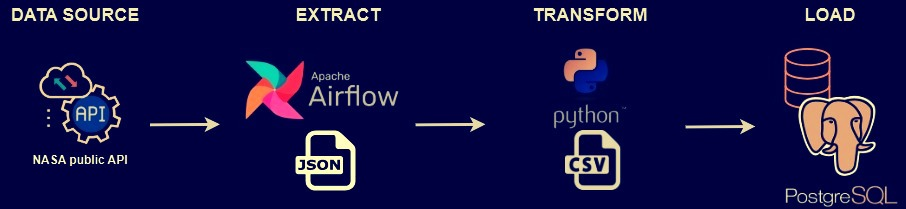

# Purpose of the Project
This project demonstrates a simple ETL pipeline using Apache Airflow, Python, and PostgreSQL. The goal is to automate semi-structured data collection from a public API, transform it into a structured format, and store it in a relational database for further analysis.

### Key Objectives:
#### Extract: 

Fetch data from the NASA Near Earth Objects (NEO) API, which provides asteroid-related information in JSON format.

#### Transform:

Check for principal keys in the JSON response.
Extract relevant data from a nested dictionary (near_earth_objects).
Convert the structured data into a CSV file for better readability and storage efficiency.

#### Load:

Create the necessary schema/table in PostgreSQL.
Load the CSV file into the database for analysis and querying.

#### Orchestrate: 

Use Apache Airflow to schedule and automate the pipeline execution.


 
## 0. Prerequisites
Before installing Apache Airflow, make sure you have the following installed on your Windows local machine: <br>
🔹Docker Desktop <br>
🔹Visual Studio Code (VSC)

## 1. Install Apache Airflow in Docker
### 1.1 Navigate to the directory where you will create your project folder:
```
cd C:\Users\annav\Documents\DE\JSON to CSV\Example 1
```
### 1.2 Create the Airflow project folder (e.g., "airflow-docker"):
```
mkdir C:\Users\annav\Documents\DE\JSON to CSV\Example 1\airflow-docker
```
### 1.3 Navigate to this folder:
```
cd C:\Users\annav\airflow-docker
```
### 1.4 Download the docker-compose.yaml file for Airflow:
```
curl -L -o docker-compose.yaml https://airflow.apache.org/docs/apache-airflow/stable/docker-compose.yaml
```
### 1.5 Open the project in Visual Studio Code (VSC):
```
code .
```
### 1.6 Modify docker-compose.yaml
Open docker-compose.yaml in VSC. Locate the volumes: section and add these lines to sync local folders with the Airflow container:
```
    - ${AIRFLOW_PROJ_DIR:-.}/scripts:/opt/airflow/scripts
    - ${AIRFLOW_PROJ_DIR:-.}/data:/opt/airflow/data
    - C:/Users/annav/Documents/DE/JSON to CSV/Example 1/airflow-docker/data:/opt/airflow/data
    - C:/Users/annav/Documents/DE/JSON to CSV/Example 1/airflow-docker/scripts:/opt/airflow/scripts
```
This ensures that scripts and data directories are mapped between your local machine and the Airflow container.
(Replace "C:/Users/annav/Documents/DE/JSON to CSV/Example 1/airflow-docker/data" and "C:/Users/annav/Documents/DE/JSON to CSV/Example 1/airflow-docker/scripts"  with the corresponding paths on your local machine.)

### 1.7 Create required folders in the project directory (in VSC terminal - Windows PowerShell):
```
mkdir logs dags plugins scripts data
```
### 1.8 Set environment variables for Docker (in VSC terminal - Windows PowerShell):
```
Set-Content .env "AIRFLOW_UID=50000`nAIRFLOW_GID=0"
```
This ensures that user and group permissions match between the host and the container.

## 2. Create Your Python Scripts
Script 1: Fetches data from the NASA API, checks the main keys of the JSON, determines if the JSON is nested, retrieves the nested dictionary 'near_earth_objects,' converts the data to CSV, and saves it in /opt/airflow/data/.

Script 2: Creates the schema/table and loads the CSV file into PostgreSQL. Save them in the scripts folder.

## 3. Create the DAG File
The DAG should orchestrate both Python scripts sequentially. Save it in the `dags` folder.

## 4. Initialize the Airflow Instance
```
docker-compose up airflow-init
```
## 5. Start All Airflow Services in the Background
```
docker-compose up -d
```
## 6. Check Running Docker Containers
```
docker ps
```
Wait until all containers show "healthy" status before proceeding.

## 7. Access Airflow Web UI
Open http://localhost:8080 in your browser.
Log in with the admin credentials from docker-compose.yaml.

## 8. Execute Your DAG
In the Search DAGs field, enter the name of your DAG (from the DAG file, e.g., "nasa_data_pipeline").
Click the DAG to open it.
Click the RUN button [▶] in the top-right corner.

## 9. Verify Data in PostgreSQL
### 9.1 Access PostgreSQL Container
```
docker exec -it airflow-docker-postgres-1 psql -U airflow -d airflow
```
### 9.2 Check if the Table Exists
```
\d nasa_asteroids;
```
### 9.3 View Sample Data
```
SELECT * FROM nasa_asteroids LIMIT 10;
```
### 9.4 Exit PostgreSQL
```
\q
```
### 9.5 Stop Airflow Services
```
docker-compose stop
```

#### Additional Notes<br>
🔹To stop the Airflow services and free memory, run:

```
docker-compose down
```
🔹To remove all containers, networks, and volumes (rebuilding Airflow from scratch):
```
docker-compose down --volumes
```